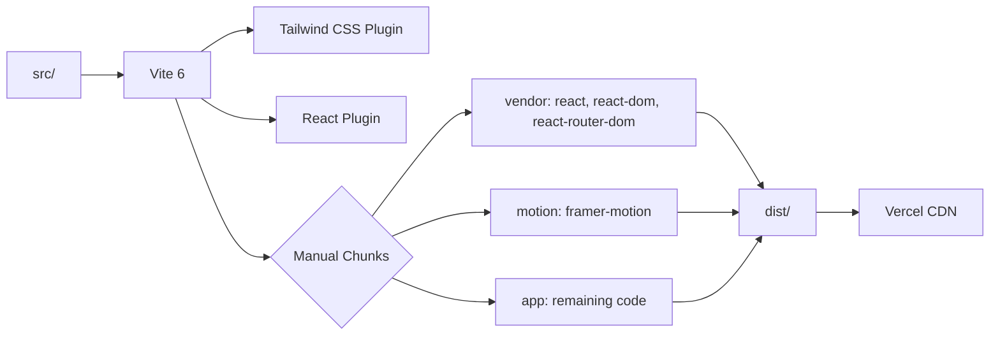

# Architecture

## Overview

A client-side rendered single-page application with no backend. All content is static and hardcoded. The app uses hash-based section navigation on the home page and path-based routing for project detail pages.

## Architecture Diagram

```mermaid
graph TB
    subgraph Browser
        HTML[index.html]
        HTML --> Main[main.jsx]
        Main --> App[App.jsx]
    end

    subgraph App Shell
        App --> Router[React Router]
        App --> Header[Header]
        App --> Footer[Footer]
        App --> Analytics[Vercel Analytics]
    end

    subgraph Routes
        Router --> Home[/ → Home]
        Router --> Detail[/project/:id → ProjectDetail]
        Router --> NotFound[* → 404]
    end

    subgraph Home Page Sections
        Home --> Hero
        Home --> Work
        Home --> About
        Home --> Skills
        Home --> Contact
    end

    subgraph External Services
        Contact --> EmailJS[EmailJS API]
    end
```

## Design Patterns

### Section-Based Composition
The home page is composed of independent section components rendered sequentially. Each section is self-contained with its own data, styling, and animations.

### Scroll-Triggered Animations
The `FadeIn` component wraps content and triggers entrance animations when elements enter the viewport using `react-intersection-observer` + Framer Motion.

### Static Data Pattern
Project data is defined as constants within component files (`sampleProjects` in ProjectDetail.jsx, `projects` in Work.jsx). No data fetching, no state management library.

### Layout Shell
`App.jsx` provides a persistent layout (Header + Footer + Analytics) with route-based content swapped via `<Routes>`.

## Build Architecture



## Navigation Model

- **Home page:** Anchor-based smooth scrolling (`#work`, `#about`, `#skills`, `#contact`)
- **Project pages:** Path-based routing (`/project/:id`) with back-link to `/#work`
- **Header:** Fixed position, links to anchors on home page
- **Mobile:** Hamburger menu toggle with same anchor links
