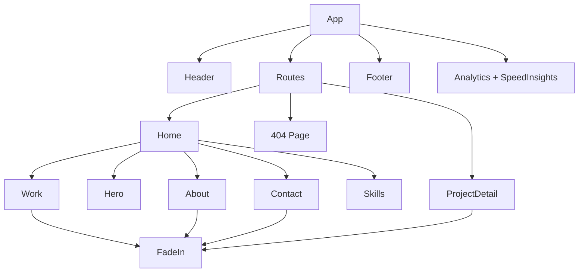

# Components

## Component Hierarchy

## Pages

### Home (`src/pages/Home.jsx`)
Composes all section components in order: Hero → Work → About → Skills → Contact. No props, no state.

### ProjectDetail (`src/pages/ProjectDetail.jsx`)
Displays a single project based on URL param `:id`. Contains hardcoded `sampleProjects` array with full project descriptions. Shows 404-style message if project not found.

## Layout Components

### Header (`src/components/layout/Header.jsx`)
Fixed-position navigation bar with:
- Brand link ("Nick Prasad")
- Desktop nav links (About, Work, Skills, Contact)
- Social icons (GitHub, LinkedIn, Mail)
- Mobile hamburger menu with toggle state

### Footer (`src/components/layout/Footer.jsx`)
Three-column grid: bio, quick links, social icons. Dynamic copyright year.

## Section Components

### Hero (`src/components/sections/Hero.jsx`)
Full-viewport hero with:
- Background image (Unsplash, animated scale-in)
- Name and tagline with fade-in
- Two CTA buttons (View Portfolio → #work, Get in Touch → #contact)
- Animated scroll indicator (bouncing arrow)

### Work (`src/components/sections/Work.jsx`)
Project showcase with alternating layout (image left/right). Each project card shows image, title, excerpt, role, date, and external link. Links to `/project/:id` for detail view.

### About (`src/components/sections/About.jsx`)
Two-column layout: profile photo + bio text with three feature cards (Data Engineering, Full Stack Development, System Optimization).

### Skills (`src/components/sections/Skills.jsx`)
Three-column grid of skill categories (Languages, Frameworks & Technologies, Tools & Infrastructure). Each skill has a name and percentage rendered as a progress bar.

### Contact (`src/components/sections/Contact.jsx`)
Two-column layout: contact info (email, phone, location) + form. Form submits via EmailJS with success/error alerts. Includes hidden timestamp field.

## Utility Components

### FadeIn (`src/components/animations/FadeIn.jsx`)
Reusable scroll-triggered animation wrapper.

**Props:**
| Prop | Type | Default | Description |
|------|------|---------|-------------|
| children | node | required | Content to animate |
| delay | number | 0 | Animation delay in seconds |
| direction | 'up'\|'down'\|'left'\|'right' | 'up' | Direction of entrance |

**Behavior:** Uses `react-intersection-observer` (triggerOnce, threshold 0.2) to detect viewport entry, then animates opacity and position via Framer Motion.
