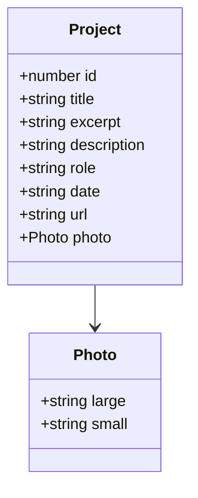
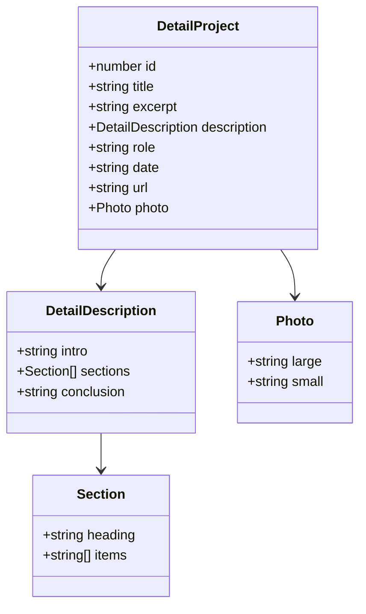
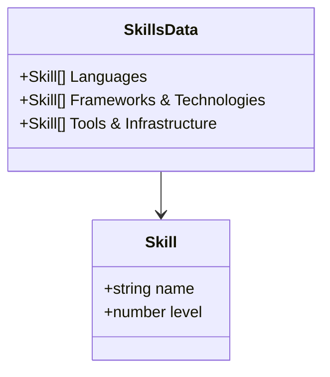

# Data Models

## Overview

All data in this application is hardcoded as JavaScript constants within component files. There is no database, no API, and no external data source (aside from one Unsplash image URL in Hero).

## Project Data

Project data exists in two locations with slightly different shapes:

### Work.jsx — Project Card Data



Location: `src/components/sections/Work.jsx` → `projects` array

### ProjectDetail.jsx — Full Project Data



Location: `src/pages/ProjectDetail.jsx` → `sampleProjects` array

### Current Projects (3 total)

| ID | Title | Role | Date |
|----|-------|------|------|
| 1 | In-Network Transformer Model for Healthcare Benefit Extraction | NLP Engineer | 2024 |
| 2 | NBA Scoreboard | Full Stack Developer | 2025 |
| 3 | Vibes Store E-Commerce Platform | Full Stack Developer | 2024 |

## Skills Data

Location: `src/components/sections/Skills.jsx` → `skills` object



## About Features Data

Location: `src/components/sections/About.jsx` → `features` array

```js
{ icon: string, title: string, description: string, bgColor: string }
```

## Contact Form Data

Submitted to EmailJS (not persisted locally):
```js
{ name: string, email: string, message: string, time: string }
```

## Data Duplication Note

Project data is duplicated between `Work.jsx` and `ProjectDetail.jsx`. The Work component has a simplified `description` (plain string), while ProjectDetail has a structured `description` object with sections. Both must be updated when adding/modifying projects.
