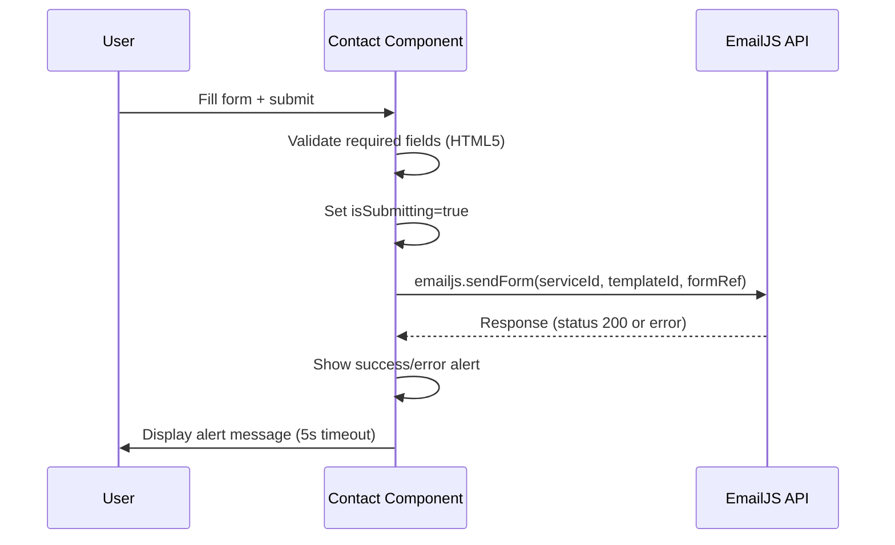

# Interfaces

## Overview

This is a frontend-only application with no custom APIs or backend services. The only external integration is EmailJS for the contact form.

## External Integrations

### EmailJS

**Purpose:** Send contact form submissions as emails without a backend.

**Integration Flow:**



**Configuration:**
- Initialized via `emailjs.init(publicKey)` on component mount
- Service ID, Template ID, Public Key from `import.meta.env.VITE_EMAILJS_*`
- Form fields sent: `name`, `email`, `message`, `time` (hidden CST timestamp)

### Vercel Analytics

**Purpose:** Page view and performance tracking.

**Integration:** Drop-in components `<Analytics />` and `<SpeedInsights />` rendered in App.jsx. No configuration required beyond Vercel deployment.

## Internal Interfaces

### Route Parameters

| Route | Params | Component |
|-------|--------|-----------|
| `/` | none | Home |
| `/project/:id` | `id` (string, matches project.id) | ProjectDetail |
| `*` | none | 404 inline |

### Component Props

| Component | Props | Notes |
|-----------|-------|-------|
| FadeIn | `children`, `delay?`, `direction?` | See components.md |
| ContactInfo | `icon`, `title`, `content`, `href?` | Internal to Contact |
| ProjectDescription | `description` | Internal to ProjectDetail |
| SkillBar | `name`, `level`, `category` | Internal to Skills |

### Data Shapes

#### Project (Work.jsx)
```js
{ id, title, excerpt, description, role, date, url, photo: { large, small } }
```

#### Project (ProjectDetail.jsx)
```js
{ id, title, excerpt, description: { intro, sections: [{ heading, items }], conclusion? }, role, date, url, photo: { large, small } }
```
