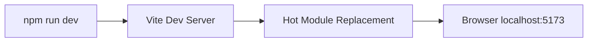
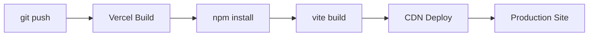
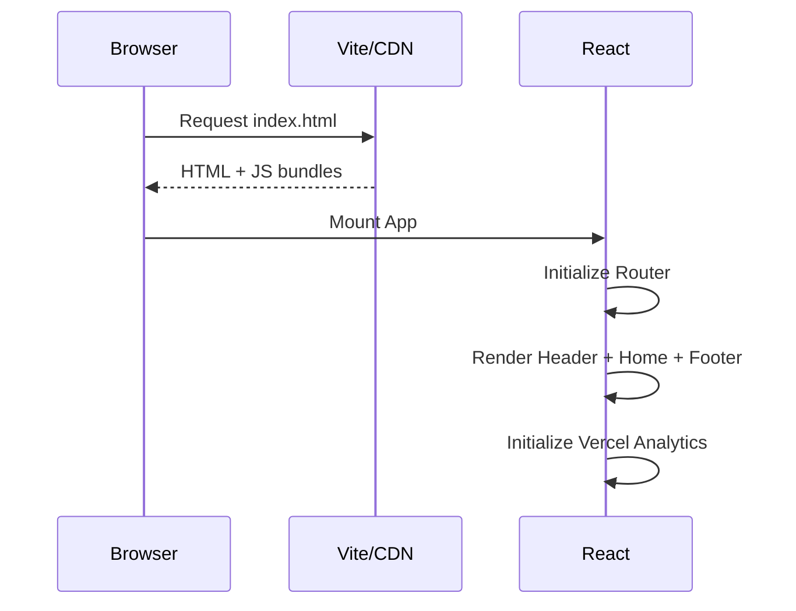
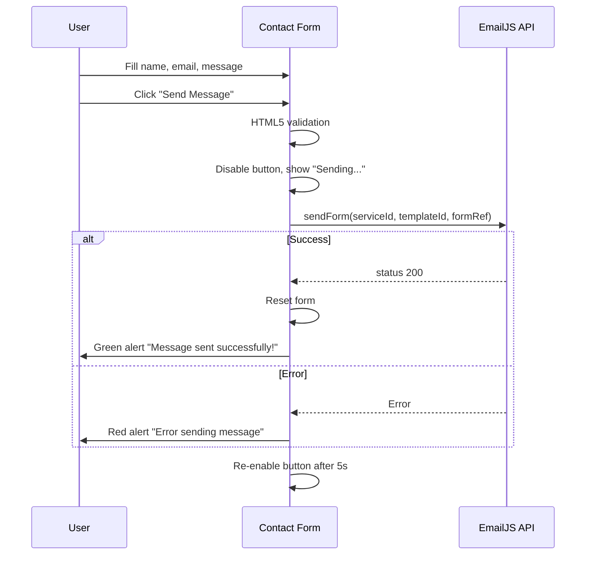
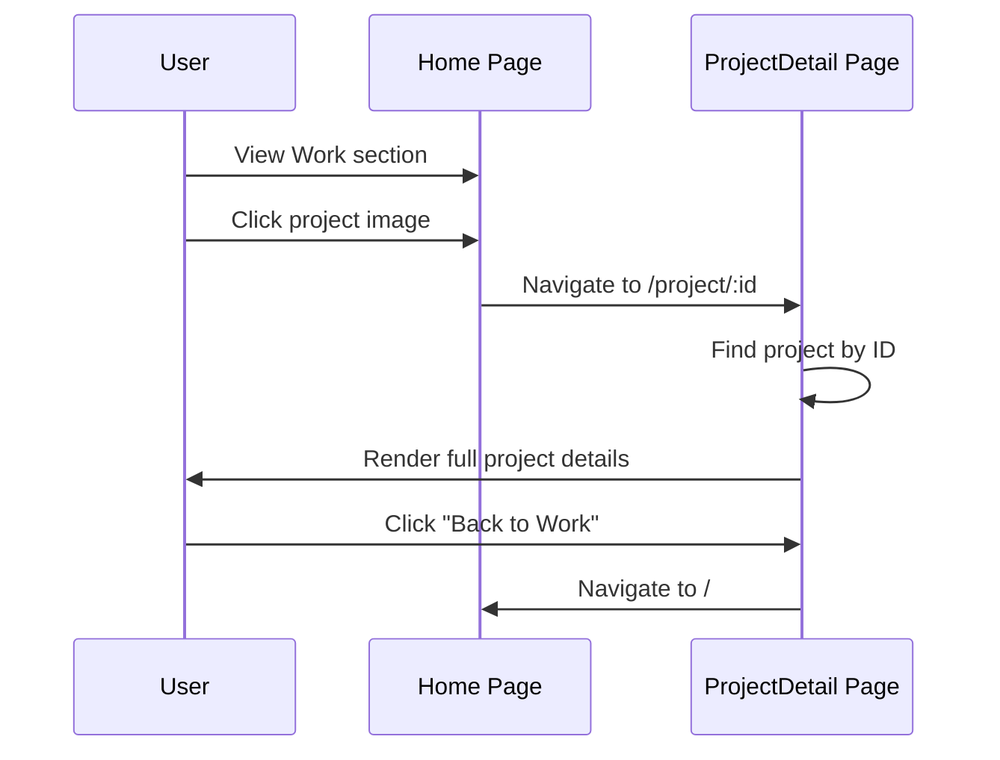

# Workflows

## Development Workflow

## Deployment Workflow

Deployment is automatic via Vercel's Git integration. Manual deploy: `vercel --prod`.

## User Interaction Flows

### Page Load

### Contact Form Submission

### Project Navigation

## Adding a New Project

1. Add project image to `src/assets/images/`
2. Import image in both `Work.jsx` and `ProjectDetail.jsx`
3. Add project object to `projects` array in `Work.jsx` (card data)
4. Add project object to `sampleProjects` array in `ProjectDetail.jsx` (full detail data)
5. Ensure `id` is unique and sequential

## Modifying Skills

Edit the `skills` object in `src/components/sections/Skills.jsx`. Each skill has a `name` and `level` (0-100 percentage).
